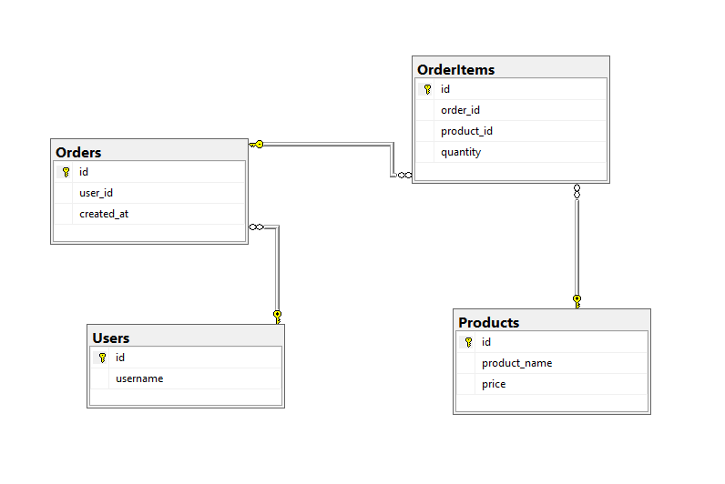

# Projekt: Relacyjna Baza Danych Sklepu Internetowego

## 📝 Opis projektu
Projekt przedstawia kompletną strukturę bazy danych dla systemu e-commerce, stworzoną w standardzie T-SQL (MS SQL Server). Głównym celem było zaprojektowanie wydajnej, znormalizowanej bazy danych, która obsługuje procesy sprzedażowe, od zarządzania użytkownikami po analizę wydatków.

Jest to projekt pokazowy przygotowany do portfolio, demonstrujący umiejętności z zakresu:
- Projektowania schematów relacyjnych.
- Optymalizacji wydajności (indeksowanie).
- Tworzenia logiki biznesowej (widoki, procedury składowane).
- Zapewniania integralności danych (klucze obce, ograniczenia CHECK).

## 🛠 Technologie
- **Silnik bazy danych:** Microsoft SQL Server
- **Język:** T-SQL (Transact-SQL)

## 🏗 Struktura Bazy Danych

Baza danych `shop_DB` składa się z czterech kluczowych tabel z zachowaniem relacji:
1. **Users**: Rejestr użytkowników systemu.
2. **Products**: Katalog produktów wraz z cenami jednostkowymi.
3. **Orders**: Nagłówki zamówień przypisane do użytkowników.
4. **OrderItems**: Pozycje zamówień łączące produkty z zamówieniami (relacja many-to-many).

### Kluczowe założenia projektowe:
- **Normalizacja (3NF)**: Usunięto kolumny wyliczalne (np. całkowita kwota zamówienia) na rzecz dynamicznych obliczeń w widokach, co eliminuje redundancję danych.
- **Integralność**: Zastosowano więzy spójności (Foreign Keys) oraz walidację wartości (np. cena i ilość nie mogą być mniejsze lub równe zero).

## ⚡ Optymalizacja i Wydajność
W projekcie zaimplementowano indeksy w celu przyspieszenia najczęstszych operacji:
- **Klucze obce**: Indeksy na `user_id` oraz `order_id` przyspieszające operacje `JOIN`.
- **Wyszukiwanie**: Indeks na nazwie produktu (`product_name`), optymalizujący filtrowanie w katalogu.

## 📊 Funkcjonalności i Logika Biznesowa
- **Widok `wydatki_uzytkownikow`**: Automatycznie wylicza łączną kwotę wydaną przez każdego klienta na podstawie aktualnych cen i ilości w zamówieniach.
- **Procedura `AddOrder`**: Bezpieczne dodawanie zamówienia z weryfikacją istnienia użytkownika.
- **Procedura `GetUserOrders`**: Pobieranie szczegółowej historii zamówień dla konkretnego ID użytkownika.
- **Zaawansowane raportowanie**: Skrypt zawiera gotowe zapytania analityczne, takie jak rankingi klientów (TOP 3) czy wykrywanie produktów, które nigdy nie zostały sprzedane.

## 🚀 Jak uruchomić projekt?
1. Zainstaluj **SQL Server Management Studio (SSMS)**.
2. Pobierz plik `setup_database.sql` z tego repozytorium.
3. Otwórz plik w SSMS i połącz się ze swoją instancją serwera.
4. Uruchom skrypt (skrót `F5`).
5. Baza `shop_DB` zostanie automatycznie utworzona, skonfigurowana i wypełniona danymi testowymi.

---
Autor: Tomasz Jarosz
